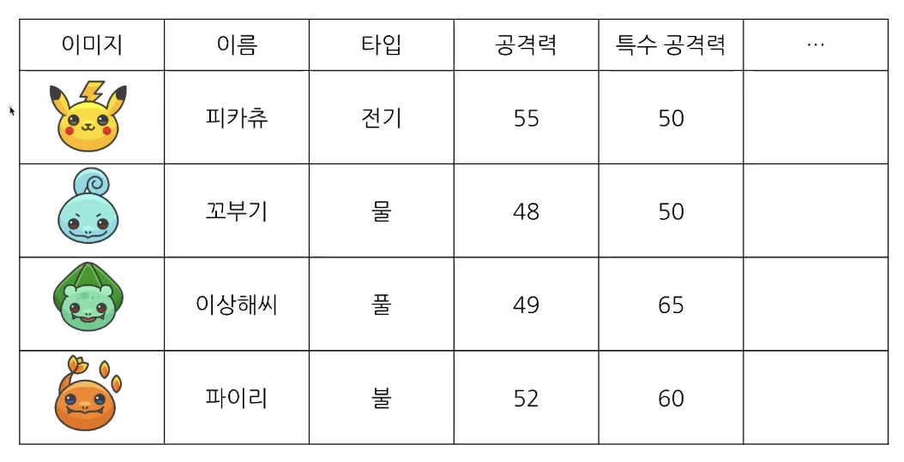
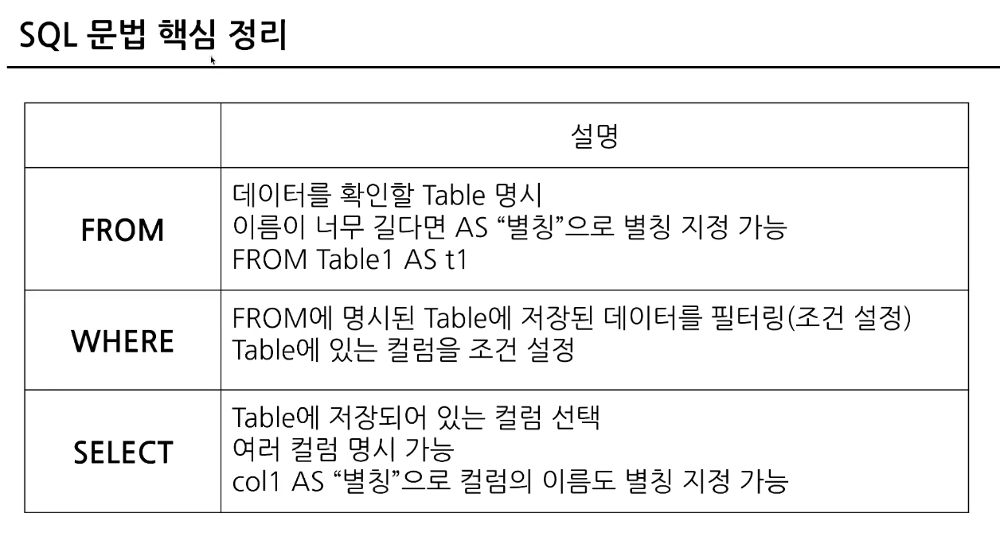
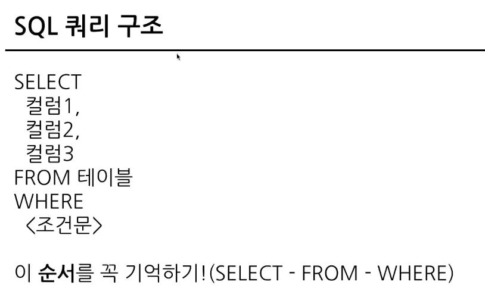
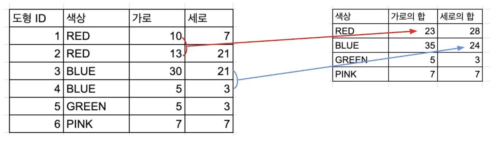
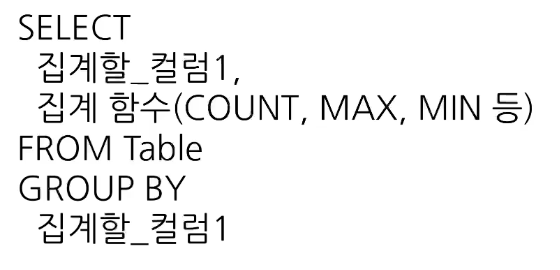
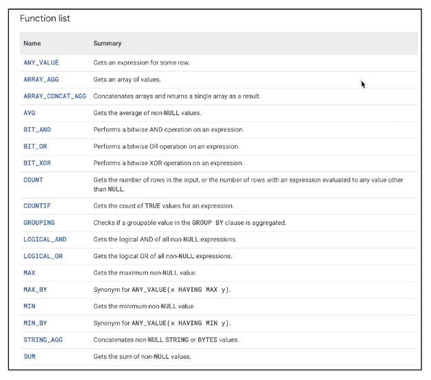
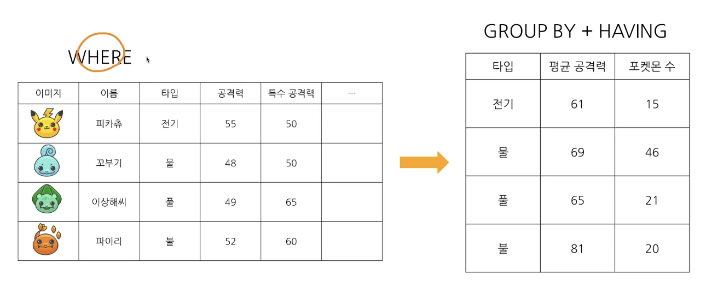
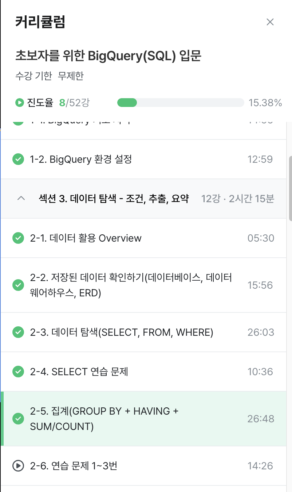

# 1주차 과제

## 2-3 데이터 탐색 (select, from, where)

#### 포켓몬으로 select 이해하기
- 포켓몬 여행 시작시 포켓몬 고민: 이름, 공격력, 방어력, 특정 타입 (포켓몬에 대한 정보)
정보, 데이터를 통해 포켓몬 선택

- 데이터베이스를 데이터베이스 테이블 형태로 생각하기

#### SQL 쿼리 구조
SELECT, FROM, WHERE 순
FROM: 어떤 테이블에서 데이터를 확인할 것인가?
WHERE: 만약 원하는 조건이 있다면 어떤 조건인가? (조건문)
SELECT: 테이블의 어떤 컬럼을 선택(출력)할 것인가?
AS: 컬럼 이름 변경
EXCEPT: 제외할 컬럼

- 집합처럼 생각해보기
특정 테이블에 있는 데이터를 추출
LIMIT 1000: row 개수제한
basic: 데이터셋
쿼리실행: 커멘트 + E

- 데이터가 여러 장소에 저장되어 있는 경우
특정 table에 있는 데이터를 각각 추출 후 연결하기 (추후에 배울 JOIN)

#### Google cloud, BigQuery 활용해보기
최종수정시간 (데이터 동기화 시점)
SQL 쿼리 입력시 스키마만 보통 봄
inflearn 빅쿼리 사용방법
프로젝트 id는 생략 가능
#은 주석
AS에서는 따옴표 사용하지 않음

## 2-4 SELECT 연습문제
모든 컬럼 -> *
특정 속성만 추출해서 출력하는 쿼리 작성 방법에 대해 자세히 알 수 있었다.
하나의 테이블에서 조건을 설정하고, 다양한 컬럼을 사용할 수 있다.

## 2-5 집계(GROUP BY + HAVING + SUM/COUNT)

#### 집계: GROUP BY:  같은 값끼리 모아서 그룹화한다.
특정 컬럼을 기준으로 모으면서 다른 컬럼에선 집계 가능(합, 평균, MAX,MIN 등)

예시: 타입을 기준으로 그룹화해서 평균 공격력 집계하기
+타입을 기준으로 그룹화해서 타입별 포켓몬 수 집계하기

- 정렬하기
내림차순, 오름차순

- 그룹화 한 값에 조건 설정하기
타입 당 포켓몬 수가 10마리 이상인 데이터만 추출하고 싶은 경우
포켓몬 수 라는 새로운 컬럼을 조건으로 걸기 (HAVING 사용)

- 집계함수 종류

- DISTINCT: 고유값을 알고 싶은 경우
여러 값 중에 유니크한 것만 보고싶은 경우 사용 (중복을 제거하는 것)

- 그룹화(집계) 활용 포인트
데이터 분석하다가 그룹화하는 경우
일자별 집계 (특정 시간에 유저 행동)
연령대별 집계 (특정 연령대 많이 구매?)
특정  타입별 집계 (제품 타입)
앱 화면별 집계 (어떤 화면에 유저 많이 접근?)

#### 조건을 설정하고 싶은 경우
- WHERE: Table에 바로 조건을 설정하고 싶은 경우
- HAVING: GROUP BY 한 후 조건을 설정하고 싶은 경우 사용 (FROM 절에 사용 가능)
서브쿼리 사용시 FROM 절에 다른 쿼리 들어갈 수 있음

#### 서브쿼리
- SELECT 문 안에 존재하는 SELECT 쿼리
- FROM 절에 또 다른 SELECT 문을 넣을 수 있음
- 괄호로 묶어서 사용
- 서브쿼리를 작성하고 서브 쿼리 바깥에서 WHERE 조건 설정하는 것 
(다양하게 서브쿼리 사용 가능하다!)
(가독성이나 활용도 잘 고려해서 서브쿼리 작성하기)

#### 정렬하기: ORDER BY
- 순서: DESC(내림차순), OSC(오름차순)
맨 마지막에 둔다.

#### 출력 개수 제한하기: LIMIT
- 쿼리문의 결과 row수를 제한하고 싶은 경우
order by, limit 순으로 사용

단계적으로 실행해보면서 다양하게 사용해보자!
