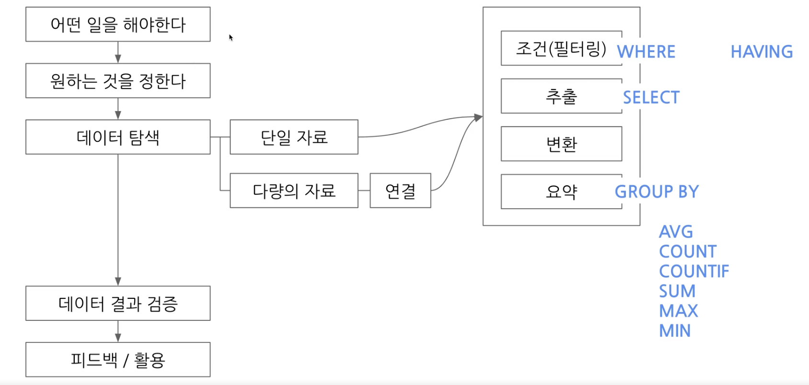
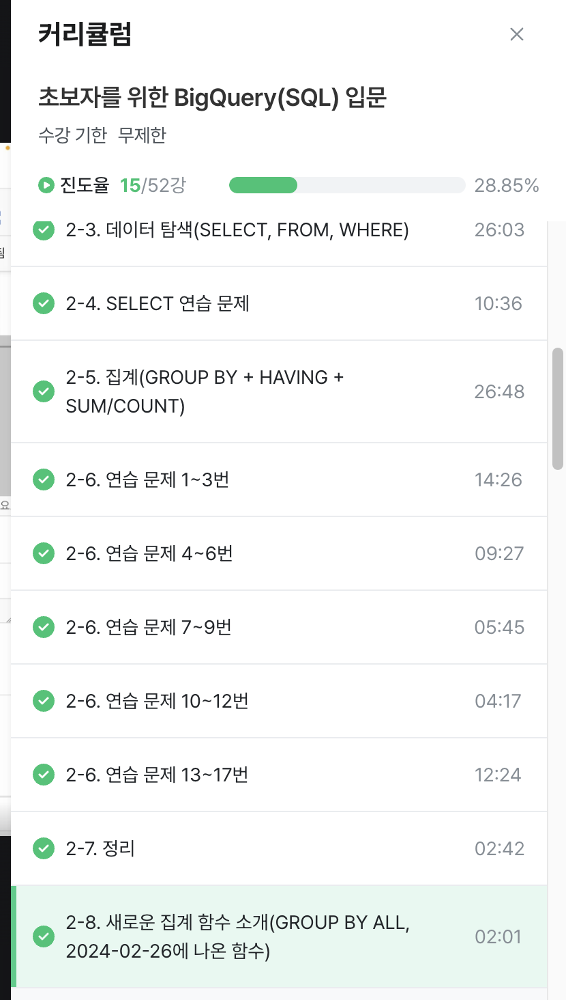

# 2주차 과제

## 2-6 데이터 탐색 - 조건,  추출, 요약 연습문제(17개)

<<<<<<< HEAD
#### 연습문제 1
- 조건, 추출, 요약 연습문제(1)
type2가 없는 포켓몬 수 작성하기
쿼리 작성할 때 조건, 어떤 테이블을 써야하는지, 어떤 컬럼, 어떻게 집계해야 할지 적고 쿼리 적기 시작하기

타입 2가 없는 -> 타입 2가 무엇인지 파악하기
NULL -> 0이랑 다르고 문자열과도 다름. 아예 값이 없는 형태임
어떤 연산자? is null 
type two is null 이라 하면 됨.
null은 다른 값과 비교할 수 없음. = 안쓰고, is 연산자 사용
포켓몬 수만 찾기

select
*
from basic.pokemon
where
type 2 IS NULL
 is not null 사용하면 널 아닌거 찾을 수 있음.

 count(id) AS cnt 사용하면 답 나옴
 and 사용하면 조건 추가할 수 있음.
 or 조건은 둘중에 하나만 성립해도 될 때
 or 조건 -> ( ) or (  )

#### 연습문제 2
타입 2가 없는 포켓몬의 타입 1과 타입1의 포켓몬 수를 알려주는 쿼리.
정렬: 타입 1의 포켓몬 수가 큰 순으로 정렬

order by 사용해서 정렬
큰 순으로 -> order by 포켓몬 dsc

빨간 밑줄 -> 에러메시지. 
집계함수는 그룹바이와 함께 다님.
집계컬럼이 없으면 count만 사용가능하지만 기준 있으면 그룹바이랑 같이 써야함.

#### 연습문제 3
타입 2 상관없이 타입 1의 포켓몬 수를 알 수 있는 쿼리
type 2 '상관없이' -> 조건인가? 아닌지 고민해보기
조건이 아님!

distinct -> 유니크한 값만 알고싶은 경우 사용함
회사에서는 중복이 있게 설계하기도 함. 
쿼리 실행할 때, distinct 사용해서 구해보기

## 2-6 연습문제 4-6번

#### 연습문제 4
- 전설 여부에 따른 포켓몬 수
from 쓴 다음에 조건 걸기 (이러면 쿼리 쓰기 더 쉬움!)
컬럼 자동완성 되기도 함. 컬럼 앞부분 입력하고 기다리면 됨.

그룹바이 할 때 컬럼이 많을 수 있음.
group by 1  -> select의 첫 컬럼을 의미
order by에도 1,2 사용 가능함.
완성된 쿼리문에서는 명확히 컬럼명을 사용하는게 더 좋음.
나중에 1,2 써보기! 나중에 헷갈릴 수 있음.

#### 연습문제 5
- 동명이인이 있는 이름은 무엇일까?
트레이너 cnt가 2 이상인 것 구하기
집계 후 조건 -> having을 사용함.
having / where 차이는?
where: 원본데이터 from 절에 있는 데이터 조건 설정하고 싶은 경우
having: group by와 함께 집계 결과에 조건을 설정하고 싶은 경우

having 사용하면 쿼리 줄 수가 줄어들기 때문에, 이거 쓰기
where에 서브쿼리 사용하면 where도 사용가능

#### 연습문제 6
- 트레이너 테이블에서 아이리스 트레이너의 정보를 알 수 있는 쿼리를 작성하기

## 2-6 연습문제 7-9번

#### 연습문제 7
특정 트레이너의 정보를 알 수 있는 쿼리
from basic.trainer
where
(name = 'Iris')
or (name = ;Cynthia')
and 사용하면 안됨. 이름이 두개인 사람은 없음
괄호 사용하는 편이 꼬이지 않아서 좋음
IN -> name에 괄호 안의 value가 있는 row만 추출

#### 연습문제 8
전체 포켓몬 수
조건 없음. 집계: 포켓몬 수 -> count (name)
unrecognized name 오류 -> 컬럼 이름의 오타.
굉장히 많이 뜨는 오류!

#### 연습문제 9
세대별로 포켓몬 수

## 2-6 연습문제 10-12번

#### 연습문제 10
타입 2 존재하는 포켓몬의 수
type 2 is not null
전체 몇행인지 보면 116행.
카운트에서도 동일한지 봐야함.
row랑 count 명령문 사용해서 더블체크 하기

#### 연습문제 11
type 2가 있는 포켓몬 중에 가장 많은 type 1은 무엇인가?
order by 포켓몬 DESC
가장 많은 것만 중요함.
행 수 제한하는 limit 사용
limit 1 사용하면 가장 많은 타입만 알 수 있음.

#### 연습문제 12
단 하나의 타입만 있는 포켓몬 중 가장 많은 타입 1
조건: 단일타입: 하나의 타입만 존재: 타입 2가 null
where type2 is null 사용하기

## 2-6 연습문제 13-17번

#### 연습문제 13
포켓몬의 이름에 파 가 들어가는 포켓몬
컬럼 like "파%"
파로 시작하는 단어.
%파% -> 파가 들어가는 단어
특정 단어가 포함되는지 파악하고 싶은 경우 = like 사용

#### 연습문제 14
벳지가 6개 이상인 트레이너 몇명?
조건 뱃지가 6개 이상
집계 트레이너 수 (count)

#### 연습문제 15
보유한 포켓몬이 제일 많은 트레이너는?
테이블: 트레이너 포켓몬
컬럼: 트레이너별 포켓몬. 트레이너 아이디
집계: 포케몬의 수 = count
count(pokemon_id) AS pokemon_cnt
값 중복 꼭 확인하기! (distinct 활용해도 좋음)

#### 연습문제 16
포켓몬을 많이 풀어준 트레이너는?
where status = "released" 사용하기
order by / limit 사용하기

#### 연습문제 17
트레이너별로 풀어준 포켓몬의 비율이 20%가 넘는 트레이너는 누구인가?
countif 사용하기
조건: 풀어준 포켓몬의 비율 20%
집계: countif 사용
countif(trainer_id=17)랑
where 사용하나 결과 동일

트레이너 아이디, 포켓몬 수 구하기 = count
서브쿼리 사용해도 됨.
released_ratio 
having에 서브쿼리 넣어서 풀기
/ 사용해서 나누기 가능
countif -> 특정컬럼 조건 걸어서 세기 가능

## 2-7 정리

having -> 집계함수와 함께 사용
order by -> 정렬
null -> 아무것도 없다.
서브쿼리 잘 활용하기
distinct -> 고윳값

## 2-8 새로운 집계함수 소개
GROUP BY ALL
최근에 나온 함수.
그룹바이에 컬럼을 명시해줘야 했는데, 이제 자동으로 전부 보여줌

group by
아래 다른 컬럼 다 추가해줬어야 했는데

이제는 GROUP BY ALL 사용시 생략가능.

=======
#### 연습문제 1
- 조건, 추출, 요약 연습문제(1)
type2가 없는 포켓몬 수 작성하기
쿼리 작성할 때 조건, 어떤 테이블을 써야하는지, 어떤 컬럼, 어떻게 집계해야 할지 적고 쿼리 적기 시작하기

타입 2가 없는 -> 타입 2가 무엇인지 파악하기
NULL -> 0이랑 다르고 문자열과도 다름. 아예 값이 없는 형태임
어떤 연산자? is null 
type two is null 이라 하면 됨.
null은 다른 값과 비교할 수 없음. = 안쓰고, is 연산자 사용
포켓몬 수만 찾기

select
*
from basic.pokemon
where
type 2 IS NULL
 is not null 사용하면 널 아닌거 찾을 수 있음.

 count(id) AS cnt 사용하면 답 나옴
 and 사용하면 조건 추가할 수 있음.
 or 조건은 둘중에 하나만 성립해도 될 때
 or 조건 -> ( ) or (  )

#### 연습문제 2
타입 2가 없는 포켓몬의 타입 1과 타입1의 포켓몬 수를 알려주는 쿼리. 정렬: 타입 1의 포켓몬 수가 큰 순으로 정렬

order by 사용해서 정렬
큰 순으로 -> order by 포켓몬 dsc

빨간 밑줄 -> 에러메시지. 
집계함수는 그룹바이와 함께 다님.
집계컬럼이 없으면 count만 사용가능하지만 기준 있으면 그룹바이랑 같이 써야함.

#### 연습문제 3
타입 2 상관없이 타입 1의 포켓몬 수를 알 수 있는 쿼리
type 2 '상관없이' -> 조건인가? 아닌지 고민해보기
조건이 아님!

distinct -> 유니크한 값만 알고싶은 경우 사용함
회사에서는 중복이 있게 설계하기도 함. 
쿼리 실행할 때, distinct 사용해서 구해보기

## 2-6 연습문제 4-6번

#### 연습문제 4
- 전설 여부에 따른 포켓몬 수
from 쓴 다음에 조건 걸기 (이러면 쿼리 쓰기 더 쉬움!)
컬럼 자동완성 되기도 함. 컬럼 앞부분 입력하고 기다리면 됨.

그룹바이 할 때 컬럼이 많을 수 있음.
group by 1  -> select의 첫 컬럼을 의미
order by에도 1,2 사용 가능함.
완성된 쿼리문에서는 명확히 컬럼명을 사용하는게 더 좋음.
나중에 1,2 써보기! 나중에 헷갈릴 수 있음.

#### 연습문제 5
- 동명이인이 있는 이름은 무엇일까?
트레이너 cnt가 2 이상인 것 구하기
집계 후 조건 -> having을 사용함.
having / where 차이는?
where: 원본데이터 from 절에 있는 데이터 조건 설정하고 싶은 경우
having: group by와 함께 집계 결과에 조건을 설정하고 싶은 경우

having 사용하면 쿼리 줄 수가 줄어들기 때문에, 이거 쓰기
where에 서브쿼리 사용하면 where도 사용가능

#### 연습문제 6
- 트레이너 테이블에서 아이리스 트레이너의 정보를 알 수 있는 쿼리를 작성하기

## 2-6 연습문제 7-9번

#### 연습문제 7
특정 트레이너의 정보를 알 수 있는 쿼리
from basic.trainer
where
(name = 'Iris')
or (name = ;Cynthia')
and 사용하면 안됨. 이름이 두개인 사람은 없음
괄호 사용하는 편이 꼬이지 않아서 좋음
IN -> name에 괄호 안의 value가 있는 row만 추출

#### 연습문제 8
전체 포켓몬 수
조건 없음. 집계: 포켓몬 수 -> count (name)
unrecognized name 오류 -> 컬럼 이름의 오타.
굉장히 많이 뜨는 오류!

#### 연습문제 9
세대별로 포켓몬 수

## 2-6 연습문제 10-12번

#### 연습문제 10
타입 2 존재하는 포켓몬의 수
type 2 is not null
전체 몇행인지 보면 116행.
카운트에서도 동일한지 봐야함.
row랑 count 명령문 사용해서 더블체크 하기

#### 연습문제 11
type 2가 있는 포켓몬 중에 가장 많은 type 1은 무엇인가?
order by 포켓몬 DESC
가장 많은 것만 중요함.
행 수 제한하는 limit 사용
limit 1 사용하면 가장 많은 타입만 알 수 있음.

#### 연습문제 12
단 하나의 타입만 있는 포켓몬 중 가장 많은 타입 1
조건: 단일타입: 하나의 타입만 존재: 타입 2가 null
where type2 is null 사용하기

## 2-6 연습문제 13-17번

#### 연습문제 13
포켓몬의 이름에 파 가 들어가는 포켓몬
컬럼 like "파%"
파로 시작하는 단어.
%파% -> 파가 들어가는 단어
특정 단어가 포함되는지 파악하고 싶은 경우 = like 사용

#### 연습문제 14
벳지가 6개 이상인 트레이너 몇명?
조건 뱃지가 6개 이상
집계 트레이너 수 (count)

#### 연습문제 15
보유한 포켓몬이 제일 많은 트레이너는?
테이블: 트레이너 포켓몬
컬럼: 트레이너별 포켓몬. 트레이너 아이디
집계: 포케몬의 수 = count
count(pokemon_id) AS pokemon_cnt
값 중복 꼭 확인하기! (distinct 활용해도 좋음)

#### 연습문제 16
포켓몬을 많이 풀어준 트레이너는?
where status = "released" 사용하기
order by / limit 사용하기

#### 연습문제 17
트레이너별로 풀어준 포켓몬의 비율이 20%가 넘는 트레이너는 누구인가?
countif 사용하기
조건: 풀어준 포켓몬의 비율 20%
집계: countif 사용
countif(trainer_id=17)랑
where 사용하나 결과 동일

트레이너 아이디, 포켓몬 수 구하기 = count
서브쿼리 사용해도 됨.
released_ratio 
having에 서브쿼리 넣어서 풀기
/ 사용해서 나누기 가능
countif -> 특정컬럼 조건 걸어서 세기 가능

## 2-7 정리

having -> 집계함수와 함께 사용
order by -> 정렬
null -> 아무것도 없다.
서브쿼리 잘 활용하기
distinct -> 고윳값

## 2-8 새로운 집계함수 소개
GROUP BY ALL
최근에 나온 함수.
그룹바이에 컬럼을 명시해줘야 했는데, 이제 자동으로 전부 보여줌

group by
아래 다른 컬럼 다 추가해줬어야 했는데
이제는 GROUP BY ALL 사용시 생략가능!

