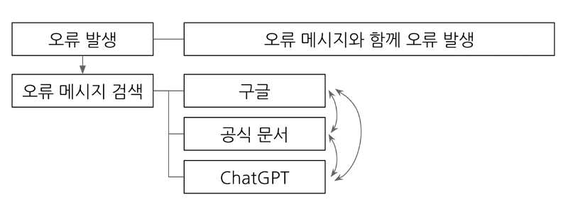
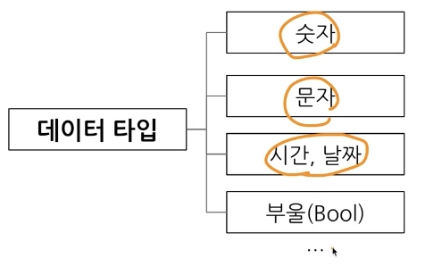
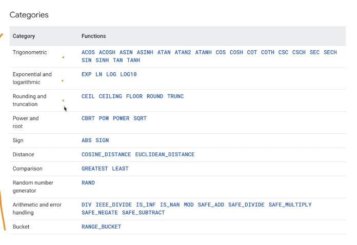
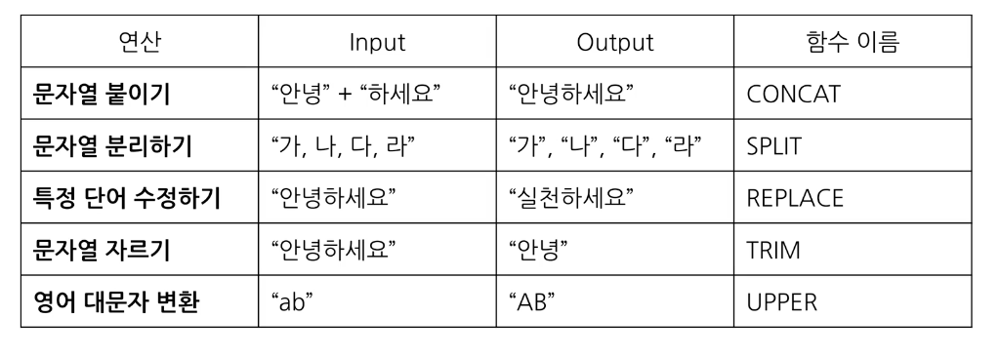
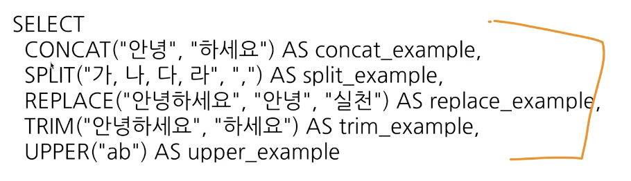
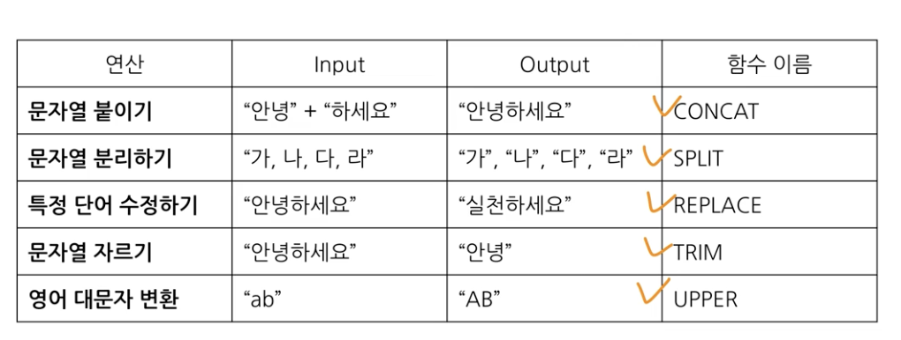
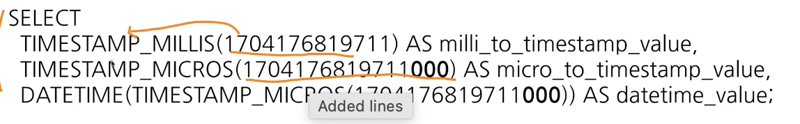
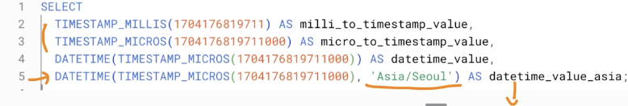
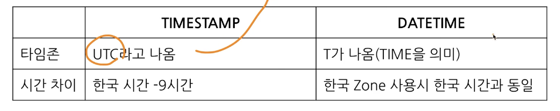
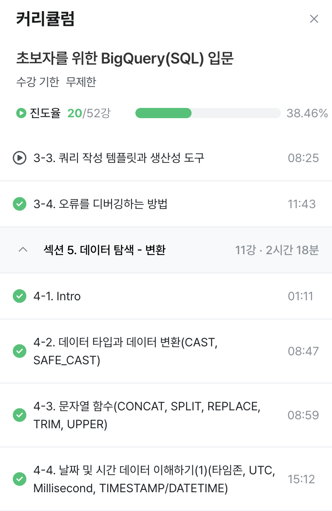

# 3주차 과제

## 3-4 오류를 디버깅하는 방법
SQL 쿼리를 작성하다가 만나는 다양한 오류
syntax 오류: 문법 오류

오류의 정의
방황하다, 길을 잃다라는 라틴어에서 유래
부정확하거나 잘못된 행동

오류메시지가 알려주고자 하는 것
길잡이 역할과, 문제진단

오류가 발생하면: 길잡이가 나를 더 좋은 길로 나아가게 하려는구나!
오류메시지를 보고 의미를 파악해야 해결하기 쉽다.

##### 빅쿼리 에러
대표적 오류 카테고리: 문법 오류
문법을 지키지 않아 생기는 오류
에러 메시지를 보고 변역, 해석한 후 해결방법 찾아보기
- 구글에 검색
- 챗지피티 질문
- 지인 질문

빅쿼리 에러:
select list must not be empty at [10:1]
select 목록은 10:1 에서 비어있으면 안된다.
10번째 줄 근처에서 오류 감지!

select from 사이가 비어있다는 오류! 중간에 컬럼 들어가야 함.

챗지피티와 함께 진행하는 오류 디버깅
 데이터 예시나 쿼리를 제공, 오류 발생한 것 말해보기
 그 후에 또 다른 시도 후 오류가 발생한다고 말하기

 number of arguements does not matxh for aggregate function COUNT
집계함수 count의 인자수가 일치하지 않음.
count 에 그룹바이가 사용되지 않아 오류 발생
그룹바이에 적절한 컬럼명 명시하지 않으면 생김

[8:1] -> 8번째줄 첫번째 칸

sql 쿼리 여러개 작성 가능. 쿼리 후 ; 넣으면 쿼리 끝났다는 표시임
드래그앤 드랍 해도 드래그 한 부분만 실행됨

Expected end of input but got keyword SELECT
입력이 끝날 것으로 예상되었지만 SELECT 키워드가 입력됨

select 근처 확인하기
하나의 쿼리엔 select 1개만 있어야 함
쿼리 끝나는 부분에 ; 붙이고 실행할 부분만 드래그 앤 드랍해서 실행하기

expect end of input but got keyword wherer at [5:1]
리밋 문제. 
리밋은 맨 아래 나와야 하는데, from 절에 나와서 잘 보지 못했기 때문.
리밋 삭제하거나 맨 아래로 옮기면 문제 해결됨!

expect ")" error
 괄호 오류. 괄호가 예상되는데 스크립트가 끝남. 괄호쓰기

 빅쿼리 가이드북 문서 보고 에러메시지 더 찾아보기

오류메시지 해결의 핵심
오류메시지 번역, 해석해보기
오류메시지 검색해서 구글, 지피티로 해결하기

오류 고치면 되는 방법 알기

## 4-1 인트로
데이터 탐색 변환
자료형에 따른 여러 함수 소개
문자, 날짜 및 시간 데이터
조건문 함수
빅쿼리 공식 문서 확인 방법

데이터 활용 과정 중 변환 파트임.
이후 다량의 자료 연결을 배울 것

## 4-2 데이터 타입과 데이터 변환
전까지는 where, select 문을 주로 사용했었음.

변환을 위한 함수
select 문에서 데이터를 변환시킬 수 있음.
또는 where 조건문에서도 사용 가능
데이터의 타입에 따라 다양한 함수 존재

##### 데이터 타입

 사용할 기본타입 먼저 공부하고 확장하기

 숫자: 1,2,3.... 같은 것들
 문자: " " 
 시간, 날짜: 2024-01-01 , 2024-01-01-23:59:17
 부울: 참, 거짓
 where 조건: true인 것만 가지고 오기 (부울타입)

##### 데이터 타입이 중요한 이유
보이는 것과 저장된 것의 차이가 존재하기 때문

멕셀에서 보면 빈 값 -> " " 일 수도 있고, 널 일수도 있음
1이라고 작성된 경우 -> 문자일수도, 숫자일수도
2023-12-31 ->문자일수도, 날짜일수도

내 생각과 다른 경우 데이터의 타입을 서로 변경해야 함.
데이터 타입은 식별 어렵기 때문에 꼭 확인해야 데이터 이해할 수 있음.

자료 타입을 변경하는 함수: CAST
AS STRING -> 숫자 1을 문자 1로 변경

select 
cast ("카일스쿨" AS int 64) -> 오류발생. 숫자로 변환 불가
safe_cast 사용하면 오류 없이 null 로 변환

##### 수학함수
수학연산 함수

암기 말고 필요할때 찾기

나누기를 할 경우 x/y 대신
safe divide 사용하기
x,y 중 하나라도 0이면 제로 에러 발생

## 4-3 문자열 함수
문자열 데이터로 할 수 있는 대표적 연산

문자열 붙이기 함수
concat

select
concat ("안녕", "하세요") AS result
from 없이도 데이터를 직접 넣어준 것이어서 괜찮다.

split
단어를 쪼개는 것
split (가, 나, 다, 라 ",") AS result
(문자열 원본, 나눌 기준이 되는 문자) 넣어서 하기

select 
replace ("안녕하세요","안녕", "실천") AS result
replace (문자열 원본, 찾을단어, 바꿀단어)

trim
문자열 자르기
trim(문자열 원본,자를 단어)

upper -> 대문자로 치환하기
upper(문자열 원본)

여러가지 한번에 사용 가능!

## 날짜 및 시간 데이터 이해하기

##### 날짜 및 시간 데이터의 핵심
1) 날짜 및 시간 데이터 타입 파악하기: date, datetime, timestamp
2) 날짜 및 시간 데이터 관련 알면 좋은 내용: UTC, Milesecond
3) 날짜 및 시간 데이터 타입 변환하기 
4) 시간 함수 (두 시간의 차이, 특정 부분 추출하기)

어떻게 date에서 datetime으로 변환하는지 등등 배워보기!

##### 시간 데이터 다루기
시간 데이터도 세부적으로 나눌 수 있음.
date: date만 표시하는 데이터
datetime: 타임까지 표시하는 데이터, time zome 정보 없음
time: 날짜 무관, 시간만 표시하는 데이터

타임존:
굉장히 중요!!
GMT: 그리니치 중앙 시간. 시간 구분선
UTC: 국제적인 표준 시간. 협정 세계시. 타임존 존재. 특정 지역의 표준 시간대

time stamp
시간 도장
utc부터 경과한 시간을 나타내는 값
타임 존 정보 있음
2023-12-31 00:00:00 utc

시간 데이터 다루기 - millesecond, microsecond

millesecond
정확한 시간을 알아야 할 때 사용
빠른 반응이 필요한 분야
millesecond -> timestamp -> datetime
ms

밀리세컨드 가지고 타임스템프 아는 법

타임존 정보 넣지 않으면 지금 시간 잘 알기 어려움
타임존 정보 넣어야 한국-서울 시간 기준으로 알 수 있다.
데이트타임 사용할때는 타임존 꼭 쓰기.

시간 데이터끼리의 변환
많은 회사들의 테이블에 시간이 타임스템프로 저장된 경우 많음

타임스템프, 데이트 타임 구분

