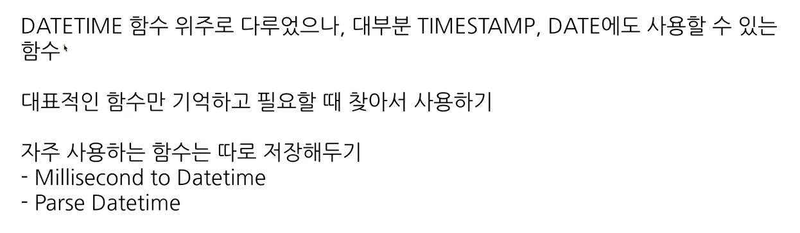

# 4-4. 날짜 및 시간 데이터 이해하기
### datetime 함수 - current_datetime
현재 datetime 출력. 타임존 넣을 수 있음.
0-9시에 실행하게 되면 타임존 넣은거 안넣은거 날짜 차이가 발생할 수 있음.

### datetime 함수 - extract
datetime에서 특정 부분만 추출하고 싶은 경우
월로 치환하고 싶은 경우 등에 사용 가능함.

extract(part(from datetime_expresstion))
이런 식으로 확인 가능

date, minute 기준 등으로 뽑는다면? 각 결과는?

나뉘어서 출력됨

요일을 추출하고 싶은 경우
extraxr(dayofweek form datetime_col) 사용하면 됨.
한 주의 첫날이 일요일인 [1,7] 범위의 값을 반환

주말 데이터만 보고 싶으면 -> 1,7만 가져오기!!

### datetime 함수 - datetime_trunc
date와 hour만 남기고 싶은 경우 -> 시간 자르기

자른 이후에 제일 작은 값으로 표현함.

### datetime 함수 - parse_datetime
문자열로 저장된 데이트타임을 데이트 타임타입으로 바꾸고 싶 은 경우
parse_datetime('문자열의 형태', ' datetime 문자열')
파싱의 뜻 -> 맞는 타입으로 바꾼다는 말

%y 등이 어떤 의미인지 알 수 있음.

### datetime 함수 - format_datetime
데이트타임  타입 데이터를 특정 형태의 문자열 데이터로 변환하고 싶은 경우

문자열 -> 데이트타임: parse_datetime
date time -> 문자열: format_datetime

### datetime 함수 - last day

마지막 날을 알고 싶은 경우: 자동으로 월의 마지막 값을 계산해서 특정연산 할 경우
last_day(datetime): 월의 마지막 값을 변환

### dateitme 함수 - datetime_diff
두 데이트타임의 차이를 알고 싶은 경우
datetime_diff(첫 datetime, 두번째 datetime, 궁금한 차이)

## 정리
날짜 및 시간 데이터 타입
- date
- datetime: date: time, timezone x
- UTC: 국제적 표준시간
- 밀리세컨드,마이크로세컨드

시간 데이터 타입 변환하기
timestamp_mills
timestamp_micros
datetime

# 4-5 시간 데이터 연습문제 1~2

## 연습문제 1
문제풀기 전에 정리하기

datetime이 컬럼명인데
timestamp 타입으로 저장되어 있는 경우가 있음!!
꼭 데이터 타입 확인하기!!

catch date가 utc 기준인지 kr 기준인지도 확인하기!!

catch_date 컬럼, catch_datetime 컬럼 비교! 다르면 catch_datetime 사용 못할 수 있음.

컬럼 꼭 파악하고 쿼리 작성하기!!

## 연습문제 2
배틀이 일어난 시간 기준으로 배틀 수 계산

winner id -> null 이면 무승부

배틀 데이트타임이랑 데이트타임 비교해보기
battle_datetime과 DATETIME(battle_timestamp, “Asia/Seoul”) 같은지 확인해보기

# 4-5 시간 데이터 연습문제 3~5
## 연습문제 3

첫날: min 사용해서 찾기
연산 순서상 포획 첫날 찾고, 날짜 변환하기
‘DD/MM/YYYY’ 형식으로 바꾸기
-> 쪼개서 만들어야 함!!
%y -> 년도
FORMAT_DATE("%d/%m/%y", min_catch_date) 이렇게 사용해야 함.

## 연습문제 4
배틀이 일어난 날짜 기준으로 요일별로 배틀 얼마나 자주 일어났는지

요일추출: extract 함수 사용하기

## 연습문제 5
트레이너가 포켓몬을 처음 포획한 날짜와 마지막으로 포획한 날짜의 간격이 큰 순으로 정렬하는 쿼리를 작성하기

# 4-6 조건문

### 조건문 함수
- 만약 특정 조건이 충족되면, 어떤 행동을 하자
- 특정 조건이 참일때 a or b
- 조건에 따른 분기 처리 필요한 경우
- 조건에 따라 다른 값 표시하고 싶을 때

조건문 사용 방법
1) case when
2) if

### 조건문 함수가 사용되는 이유
데이터 분석시 특정 카테고리 하나로 합치는 전처리 필요할 수 있음
학년별 성적 평균 등에 사용 가능함.
일주일 택시비 데이터 분석시 주말/주중 나눌 수있음.

이런 일 발생하는 이유
- 데이터 저장하느 쪽, 분석 쪽 나뉘고
- 분석할 때 필요한 부분에서 조건 설정하여 변경하는 것이 유용
- 저장할 때부터 특정 카테고리 합쳐 저장하면 쪼개서 보고 싶을때 볼 수 있음

### 조건문 1 case when
여러 조건문 있을 때 유용
SELECT
	CASE
		WHEN 조건1 THEN 조건1이 참일 경우 결과
		WHEN 조건2 THEN 조건2이 참일 경우 결과
		ELSE 그 외 조건일 경우 결과
END AS 새로운_칼럼_이름

예시:
포켓몬 데이터: type 1, type 2
rock, ground 타입 나누기

### 조건문 1 case when 순서 (중요!!!)

각 포켓몬 공격력 기준으로 50 이상이면 strong, 100 이상이면 very strong, 이하면 weak 표시

쿼리를 작성하는 목표, 확인할 지표: type이 rock 또는 ground면, rock&ground 라고 수정
쿼리 계산 방법: casewhen
데이터의 기간: x
사용할 테이블: pokemon
join key: x
데이터의 특징: type1,2 모두 고려해야 함

조건 둘다 해당시 앞선 순서 따른다.
문자열 함수(특정 단어 추출) 에서 이슈 발생가능. 

### 조건문 2 if
단일 조건일 경우 유용

문법
IF(조건문, Ture일 때의 값, False일 때의 값) AS 새로운_칼럼_이름

SELECT
	IF(1=1, '동일한 결과','동일하지 않은 결과')AS result1,
	IF(1=2, '동일한 결과','동일하지 않은 결과')AS result2
동일한 결과, 동일하지 않은 결과

# 4-7  조건문 함수 연습 문제

1. 포켓몬의 ‘Speed’가 70이상이면 ‘빠름’, 그렇지 않으면 ‘느림’으로 표시하는 새로운 칼럼 ‘Speed_Category’를 만들어주세요.

2. 포켓몬의 type1에 따라 water, fire, electric 타입은 각각 물, 불, 전기로 그 외 타입은 기타로 분류하는 새로운 컬럼 type_korean을 만들어 주세요.

3. 각 포켓몬의 총점(total)을 기준으로, 300 이하면 ‘low’, 301에서 500 사이면 ‘medium’, 501이상이면 ‘high’로 분류해주세요.

4.  각 트레이너의 배지 개수를 기준으로 5개 이하면 beginner, 6개에서 8개 사이면 Intermediate, 그 이상이면 advanced로 분류해주세요.

5. 트레이너가 포켓몬을 포획한 날짜(catch_date)가 ‘2023-01-01’ 이후이면 recent, 그렇지 않으면 old로 분류해주세요.

6. 배틀에서 승자(winner_id)가 player1_id와 같으면 player 1 wins, player2_id와 같으면 player2wins, 그렇지 않으면 draw로 결과가 나오게 해주세요.

# 4-8 정리
### 컬럼 변환하기 정리

숫자: 사칙연산
문자: concat, split, replace trim, upper 등
시간, 날짜: extract, datetime_trunc 등
부울: casewhen, if

데이터 타입 변경하기: 
- 조건문: 특정 조건이면 변경하기
- casewhen
- if

# 4-9. BigQuery 공식 문서 확인하는 법

### 개발 공식 문서
프로그래밍 언어, 라이브러리 등은 해당 기술 사용 방법에 대한 문서 제공
완성도 다르지만 참고서 느낌
처음에는 어려워 보여도 익숙해지면 빠르게 파악 가능
빅쿼리 + 대부분 프로그래밍 관련 내용 적용 가능

찾는법
기술명 + documentation으로 검색

빅쿼리는 구글 클라우드 url을 찾을 수 있음.

빅쿼리는 기능 많고 발전 오랜 제품이라 공식문서 자료 많음.
목적에 맞는 문서 탐색하기

### big query documentation
작성된 내용 무엇 있는 확인해보기

### 다양한 문자열 함수
만약 concat 문법 알고싶다면
빅쿼리 + concat 문법으로 서칭
공식문서에서 ctrl +f 사용하여 문법쪽 확인
+ 예제 쿼리도 같이 제공함!!

### 공식문서도 볼 수 있어야 함.
챗지피티나 블로그는 참고 가능하지만 잘못된 경우나 과거 문법일 수 있음
구글 관리 문서임으로 기준점으로 삼아보기
방대한 양이기 때문에필요할 때만 공식 문서 보기

예시: 작업 한다 -> 찾아보기 ->  a함수 써야함 -> a 함수 공식문서 보기

공식문서 슬랙 추가하여 업데이트 사항 파악하기

