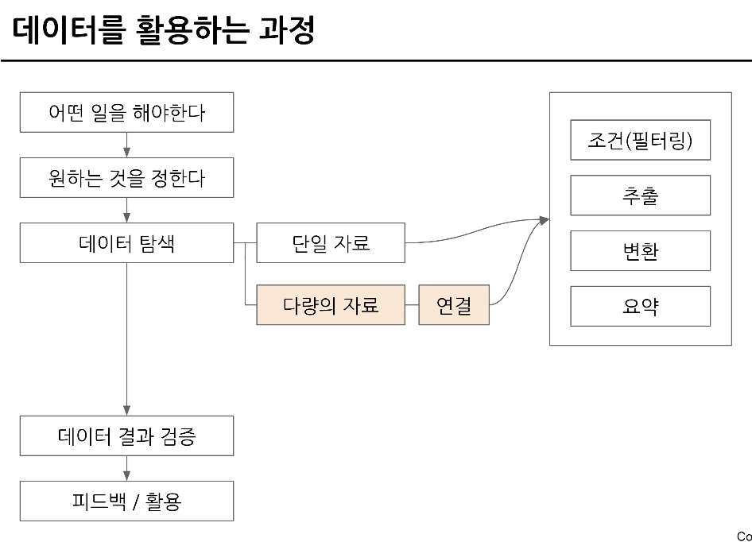
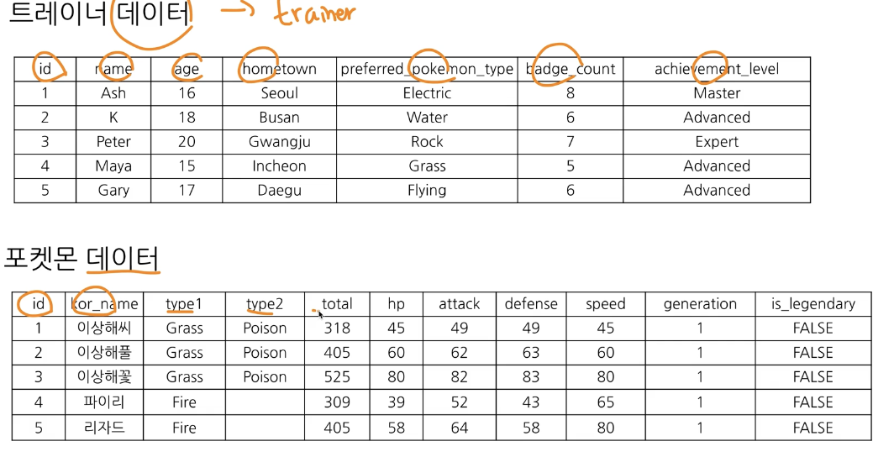
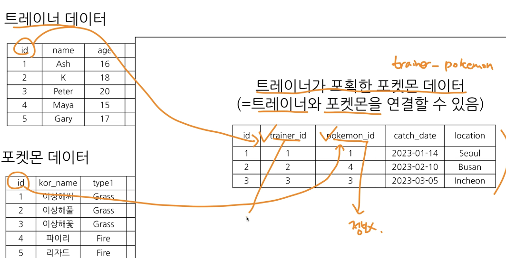
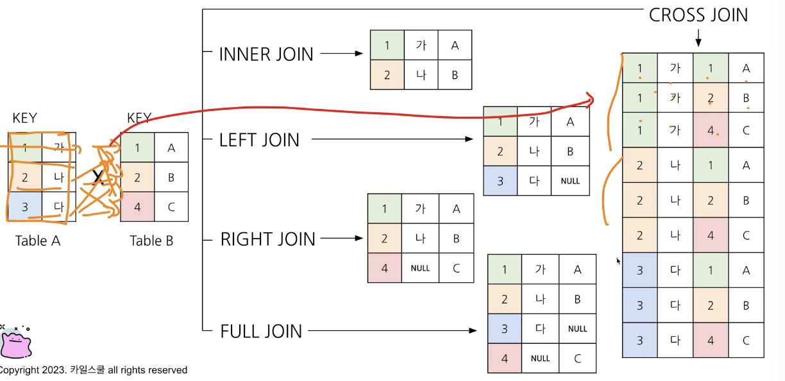
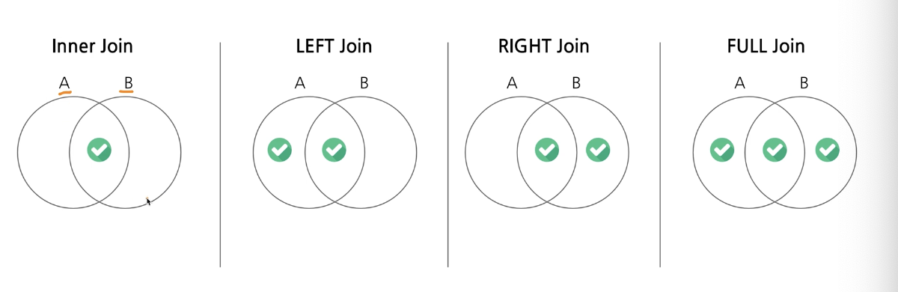
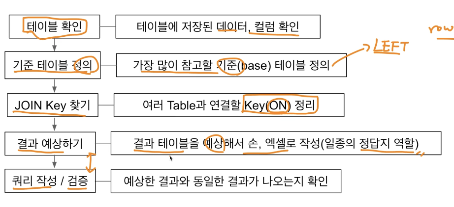
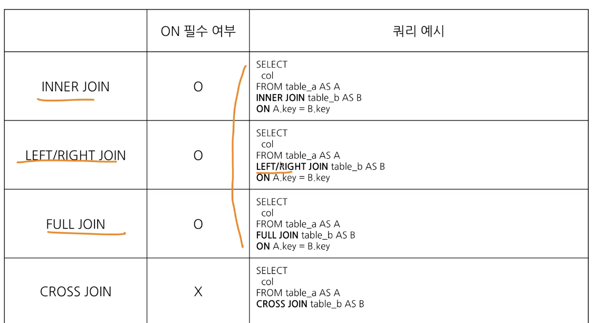
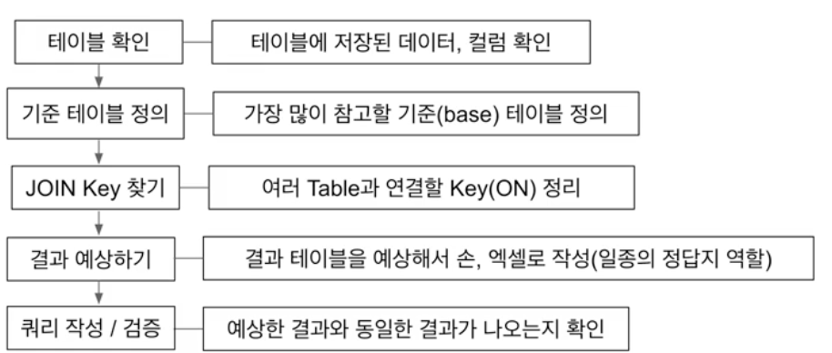
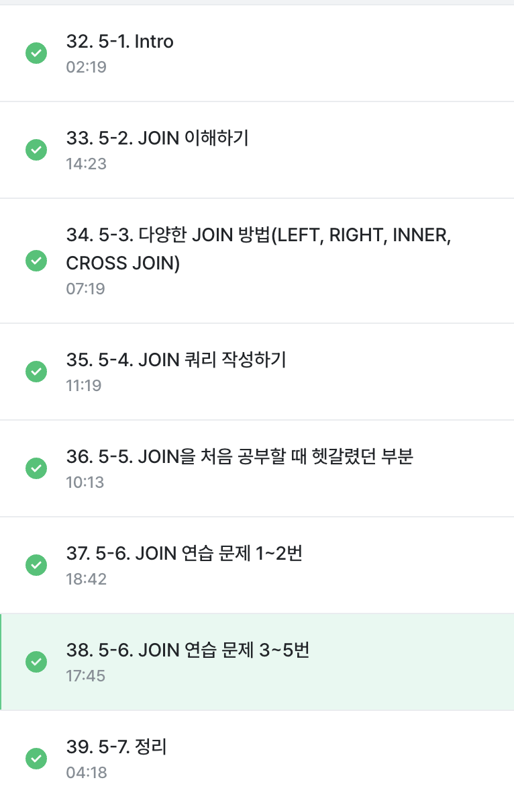

# 5-1 다양한 자료를 연결 join

데이터 탐색 후 자료를 연결할 때 사용함.

이번 파트에서 다룰 내용
포켓몬으로 join 이해하기
다양한 join 방법
join 쿼리 작성하기
join을 처음 공부할 때 헷갈렸던 부분
join 연습문제

# 5-2 조인 이야하기
SQL 처음 배울 때, 어려울 수 있는 부분임.
간단하게 '서로 다른 데이터 테이블을 연결하는 것'

쿼리작성 -> 결과 -> 확인 -> 다시시도 -> 결과
방식으로 공부하면 좋음!!

### 포켓몬으로 join 이해하기

트레이너 데이터, 포켓몬 데이터

두 데이터를 연결할 수 있는 공통값이 없음!
id도 각각 다름.

연결할 수 있는 테이블인지 확인할때는 id를 확인하기.

트레이너와 포획한 포켓몬 데이터 = (트레이너와 포켓몬 연결 가능!)

연결할 수 있는 key = trainer id, id
trainer id 컬럼 기준으로 트레이너 데이터를 연결!

여러 테이블 조인 가능! 하나씩 연결하기~~

공통적으로 존재하는 컬럼 키 가 있다면 조인 가능!으
보통 id 값을 많이 사용하고 특정 범위도 사용 가능함.

### 조인을 해아하는 이유
데이터 저장되는 형태에 대한 이해
관계형 데이터베이스 설계시 정규화 과정을 거침
정규화는 중복을 최소화하게 데이터 구조화

한번에 다 결합시 중복이 많이 발생할 수 있음.
이거를 막고싶기 때문에! 서비스가 느려질 수 있음.

데이터 분석 관점에서는 조인 되어있는게 좋지만
개발관점에서는 분리되어 있는 것이 좋다!

대신 데이터 웨어하우스에서 join + 필요한 연산을 해서
데이터 마트를 만들어 활용

# 5-3 다양한 join 방법

inner join: 공통 요소만 연결
left/dight(outer) join: 왼,오 테이블 기준으로 연결
full(outer) join: 양쪽 기준으로 연결
cross join: 두 테이블의 각각의 요소를 곱하기

처음에 어렵다면 left join 만 주로 사용해도 충분

join 집합 관점으로 생각하기

합집합, 차집합, 교집합 등....

두개 테이블에 대해 어떻게 알고싶은지, 연결하고 싶은지에 따라 조인 방식이 달라짐!

# 5-4 join 쿼리 작성하기

SQL JOIN 문법
from 하단에 join 할 테이블을 작성하고
on 뒤에 공통된 컬럼을 작성

테이블 이름이 길 수 있기 때문에 별칭을 정의해줄 수 있음.

### 여러 조인 별 쿼리 예시

from, join, on 이 핵심!!

tp * -> 트레이너 포켓몬의 모든 것 가져온다는 것

except(id) -> 조인할때 자주 사용하는 것

# 5-5 join 처음 공부할 때 헷갈렸던 부분
1) 여러 join 중 어떤 것을 사용해야 할까?
하려고 하는 작업의 목적에 따라 join 선택하기
교집합: innver
모두 다 조합: cross

아니라면 left/right
그 중에서도 left 추천!

2) 어떤 테이블을 왼쪽에 두고, 어떤 테이블이 오른쪽에 가야할까?
기준이 되는 테이블을 왼쪽에 두기
기준에는 기준값이 존재하고, 우측에 데이터를 계속 추가하기

3) 여러 테이블을 연결할 수 있을까?
조인 개수에 한계는 없음.
너무 많이 조인하지 않도록!!

4) 컬럼은 모두 다 선택하나?
컬럼 선택은 데이터를 추출해서 무엇을 하고자 하냐에 따름
join 잘 되었나 확인하기 위해 처음엔 많은 컬럼을 선택해도 괜찮으나,
사용하지 않을 컬럼은 선택하지 않는 것이 빅쿼리에서 비용을 줄일 수 있음.
id 같은 값은 유니크한지 확인하기 위해 자주 사용되므로 id는 자주 사용하는 편

5) null 이 뭐지?
값이 없음, 알수없음
0이나 공백과 다르게 값이 없는것
join 에선 연결할 값이 없는 경우 나타남

# 5-7 정리
join: 여러 테이블을 연결해야 할 때 사용하는 문법
key: 공통적으로 가지고 있는 컬럼

